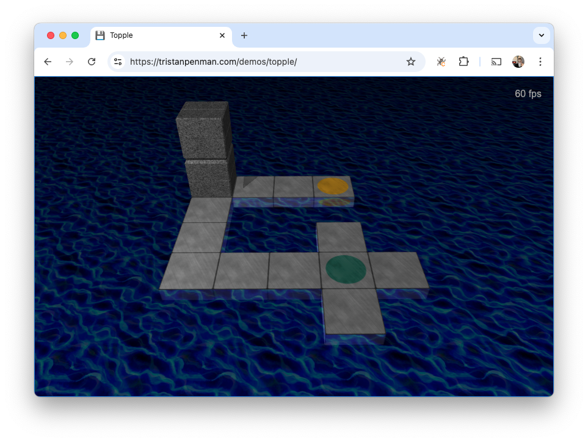

# Topple

Prototype for a block puzzle game, inspired by [Bloxorz](https://flashgaming.fandom.com/wiki/Bloxorz).

Topple is written in TypeScript, using the [Babylon.js](https://www.babylonjs.com/) 3D engine.

## Demo

A live demo can be found [here](https://tristanpenman.com/demos/topple/).

## Development

The dependencies for this project are somewhat out of date (e.g. Webpack 4, Babylon.js 6). It is known to work with Node 16.

### Usage

Getting up and running should be as simple as running `yarn`.

You can then start the dev server using `yarn start`.

### State

The block can be in one of three orientations, easily denoted as one of three axis, X, Y, or Z.

We follow the convention that, after each move, the block's position is the center of the face that is currently on the ground plane. This applies for both long and short sides, and must be taken into account when checking whether a block has moved into an invalid position.

## License

This code is licensed under the MIT License.

See the [LICENSE](./LICENSE) file for more information.
